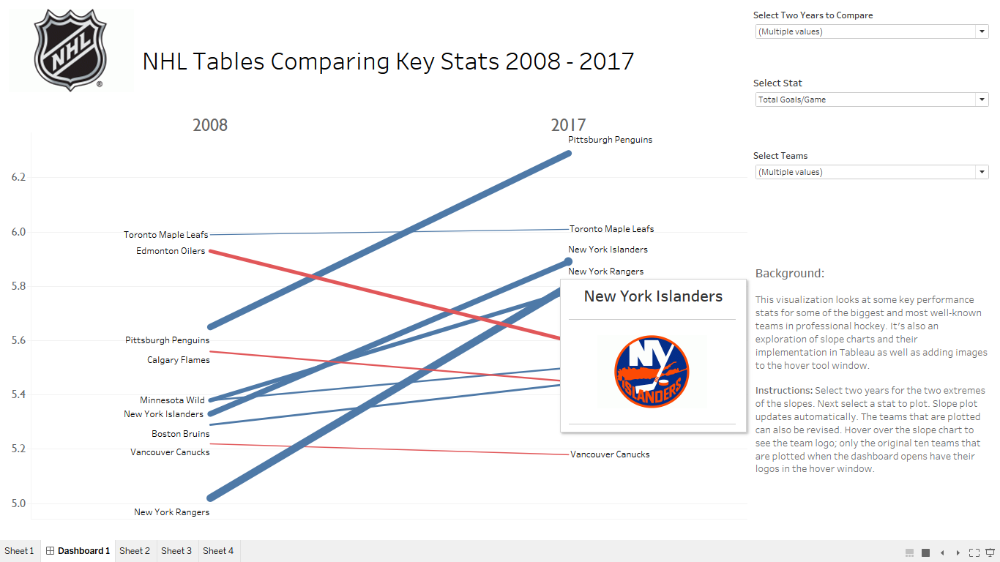

```{r setup, include=FALSE}
knitr::opts_chunk$set(echo = FALSE, 
                      collapse = TRUE,
                      comment = "#>",
                      fig.path = "README-")
```

## About

This repo is a simple container for my practice plots. I work with _ggplot_, _matplotlib_, and _Tableau_ primarily to build attractive visualizations. The goal is to build a plot a day and add it to this container. As the title notes, I don't to adding a plot quite everyday...

## The Plots
**Plot 5 - May 6, 2018**
This visualization was a duplication exercise of a [plot in the NYTimes](https://www.nytimes.com/2018/05/04/business/economy/jobs-report.html). It was created using ggplot2.

```{r echo=FALSE, warning=FALSE, message=FALSE, fig.align='center'}
### Daily Plot for May 6, 2018 ###

# Plot of historical unemployment data in the US from 1948 through April 2018

# get packages
library(ggplot2)
library(lubridate)

# get data
t3 <- read.csv("employment/unemployment_data.csv")
r <- read.csv("employment/recession_data.csv")

# format data
r$start <- as.Date(r$start)
r$end <- as.Date(r$end)
t3$dt <- as.Date(t3$dt)

# create plot
ggplot() + 
        
        # time series line of unemployment rate
        geom_line(data=t3,
                  aes(x=dt, y=value), 
                  show.legend = F) + 
        
        # point with label for rate April 2018
        geom_point(data=data.frame(x=c(as.Date("2018-04-01")), y = c(3.9)), 
                   aes(x=x, y=y)) +
        geom_text(data=data.frame(x=c(as.Date("2018-04-01")), y = c(3.9)),
                  aes(x=x, y=y, label = paste0(y, "%")),
                  nudge_x = 20, nudge_y = -0.25,
                  size = 4, color="blue") +
        
        # bands for periods of recession
        geom_rect(data=r, aes(xmin=start, xmax=end, ymin=2, ymax=11), 
                  color=NA, fill="grey50", alpha=0.2) +
        
        # labels and titles
        labs(title="US Unemployment Rate", 
             subtitle="Recessions marked by gray bands", 
             y="Unemployment Rate (%)") + 
        
        # reference line for comparing historic precedence of April 2018 rate
        geom_hline(yintercept = 3.9, 
                   size = 1, 
                   color="blue", 
                   alpha=0.5,
                   linetype = 2) +
        
        # axis formatting
        scale_x_date(breaks = seq(as.Date("1945-01-01"),
                                  as.Date("2020-01-01"),
                                  "5 years"),
                     labels = year(seq(as.Date("1945-01-01"),
                                       as.Date("2020-01-01"),
                                       "5 years"))) +
        scale_y_continuous(limits = c(2, 11),
                           breaks = seq(2, 11, by = 2),
                           labels = as.double(seq(2, 11, by = 2))) +
        
        # plot panel formatting
        theme_minimal() + theme(plot.title = element_text(hjust = 0.5, 
                                                          size = 18), 
                           plot.subtitle = element_text(hjust = 0.5, size = 8),
                           axis.line = element_line(),
                           axis.text.x = element_text(size = 10,
                                                      hjust = 1,
                                                      angle = 70),
                           axis.text.y = element_text(size = 10),
                           axis.title.x = element_blank())


```


**Plot 4 - May 5, 2018**

This visualization looks at some key performance stats for some of the biggest and most well-known teams in professional hockey. 

Data: www.sports-reference.com. Use agreement: https://www.sports-reference.com/termsofuse.html

It's also an exploration of slope charts and their implementation in Tableau as well as adding images to the hover tool window. The full dashboard can be experienced [here](https://public.tableau.com/profile/conner.mcbride#!/vizhome/NHLHockeyStatsSlopeChart/Dashboard1?publish=yes).And a snapshot:



**Plot 3 - April 24, 2018**

This plot, a slope chart, was inspired by the walk-through in Ben Jones' _Communicating Data with Tableau_. The dataset is one of the sample sets that comes with Tableau, World Indicators. The dataset worked well for practicing the slope chart but the slope chart isn't necessarily the best choice for some of the indicators that can be selected. Still it was great practice, and I've added an useful plot type to my repertoire. The full dashboard can be experienced [here](https://public.tableau.com/profile/conner.mcbride#!/vizhome/slopechart_exploration/Dashboard1?publish=yes). And a snapshot of the dashboard plotting changes in GDP between 2000 and 2012 on selected countries:


**Plot 2 - April 9, 2018**

This plot from a walk-through by Ben Jones in his book _Communicating Data with Tableau_. The full interactive dashboard can be experience [here](https://public.tableau.com/profile/conner.mcbride#!/vizhome/presidents_timeline/Dashboard1?publish=yes). A snapshot of the dashboard:


**Plot 1 - April 2, 2018**

Not just a plot, this example is a dynamic app that allows the user to select state and year values to plot the geographic distribution of earthquakes by the selected variables. The app uses a live API to query the USGS for historical earthquake data. The API algorithm required some maintaince work and help was provided by [other developers at StackOverflow](https://stackoverflow.com/questions/49545608/r-what-causes-error-when-using-usgs-api?noredirect=1#comment86099289_49545608). The reactive function uses max/min latitude and longitude of the selected state to narrow the query and speed plotting. It then tests each observation point with a "inpolygon" test, before plotting. The app can be experienced [here](https://connermcb.shinyapps.io/quakes_shiny_app/). A snapshot of the app and a sample plot:


**Plot 0 - March 27, 2018**

This plot is my rendition of a [beautiful line graph](https://www.nytimes.com/interactive/2018/03/23/climate/arctic-ice-maximum.html) published on March 3, 2018 in the New York Times that accompanied an article by KENDRA PIERRE-LOUIS, NADJA POPOVICH and ADAM PEARCE on decreases in arctic sea ice. My plot is an exercise in trying to produce similar results.

The plot was built with ggplot2 in RStudio.The dataset is documented and available from the [National Snow & Ice Data Center](https://nsidc.org/data/search/#keywords=sea+ice/sortKeys=score,,desc/facetFilters=%257B%257D/pageNumber=1/itemsPerPage=25) with compressed csv files for download at a [linked FTP server](ftp://sidads.colorado.edu/DATASETS/NOAA/G02135/). 

```{r echo=FALSE, warning=FALSE,message=FALSE}
library(ggplot2)
library(readr)
library(lubridate)
library(dplyr)
```

```{r echo=FALSE,message=FALSE, warning=FALSE}
setwd("../../conner/daily_plots/")

ice_df <- read_csv("sea_ice/N_seaice_extent_daily_v3.0.csv")
```

```{r echo=FALSE,warning=FALSE}
## format and clean data

# modify variable class
ice_df$Extent <- as.numeric(ice_df$Extent)

# remove irrelevant variables
ice_df <- ice_df[2:nrow(ice_df), -c(5, 6)]

# remove partial year 1978, partial data
ice_df <- subset(ice_df, Year != "1978")

# subset for winter months
ice_df <- subset(ice_df, Month %in% c("01", "02", "03", "04", "05"))
```

```{r echo=FALSE,}
## format month/day dates for plotting years in same plot frame

# combine month and day into string 
full_dates <- with(ice_df, paste0(Month, "/", Day, "/", Year))
full_dates <- mdy(full_dates)
mnth_day <- format(full_dates, format="%m-%d")

# add month/day to df
ice_df <- cbind(ice_df, mnth_day)

# add mean extension of ice by year
ice_df$annual_mean <- ave(ice_df$Extent, ice_df$Year)

# get max extension of ice by year
maxes <- ice_df %>%
         group_by(Year) %>%
         slice(which.max(Extent))
         
```


```{r echo=FALSE,}
# define color palette
brks <- seq(from=90, to=40, length.out = 40)
palt <- sapply(brks, function(x){hcl(h=180, c=0, l=x)})

```


```{r echo=FALSE, fig.align="center", fig.height=5, fig.width=8}
# plot of sea ice extent
ggplot()+
  
  # line plot of all year except 2018
  geom_line(data=subset(ice_df, Year != "2018"),
            aes(x=mnth_day, y=Extent, color=Year, group=Year), 
            size=1) +
  
  # line plot of only 2018
  geom_line(data=subset(ice_df, Year == "2018"), 
            aes(x=mnth_day, y=Extent, group=Year), 
            size=1.25, color="black", lineend="square") +
  
  # color scale using custom palette
  scale_color_manual(values=palt, guide=FALSE) +
  
  # max value background
  geom_point(data=maxes, aes(x=mnth_day, y=Extent),
             color="grey20", size= 3) +
  
  # max value foreground
  geom_point(data=maxes, aes(x=mnth_day, y=Extent, color=Year),
             size= 2) +
  
  # max value 2018
  geom_point(data=subset(maxes, Year==2018),
             aes(x=mnth_day, y=Extent),
             color="black", size= 2) +
  
  # labels for 2018, 1979
  geom_text(data=subset(maxes, Year %in% c("1979", "2018")),
            aes(x=mnth_day, y=Extent, label=Year),
            nudge_x = 3.5, nudge_y = 0.175)+
  
  # Formatting
  labs(title="Extent of Artic Winter Sea Ice by Year",
       y="Millions of Square Kilometers",
       x="") +
  scale_x_discrete(breaks=c("01-01", "02-01", "03-01", "04-01", "05-01", "05-30"),
                   labels=c("Jan", "Feb", "Mar", "Apr", "May", "June"))+
  scale_y_continuous(breaks=c(12, 14, 16)) +
  theme(plot.title = element_text(hjust = 0.5, size=20),
        plot.background = element_blank(),
        panel.background = element_blank(),
        panel.grid = element_blank())

```
