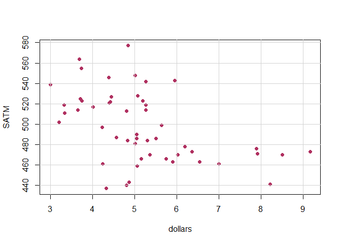
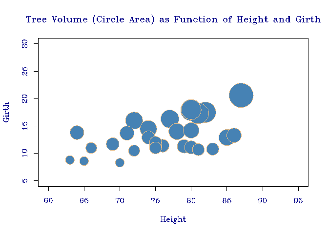
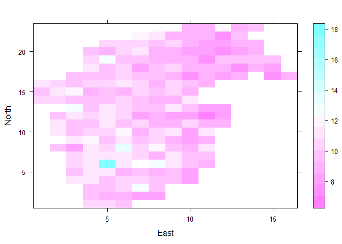
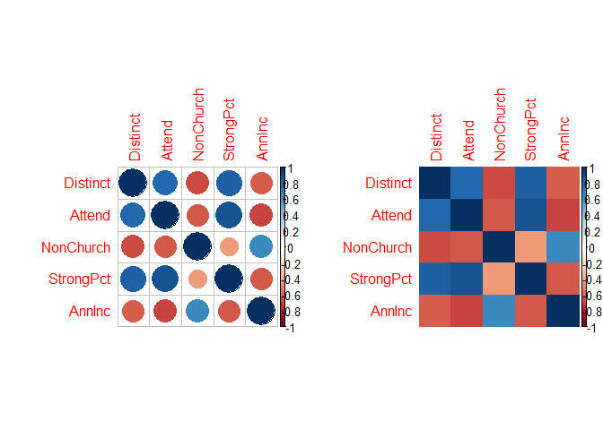
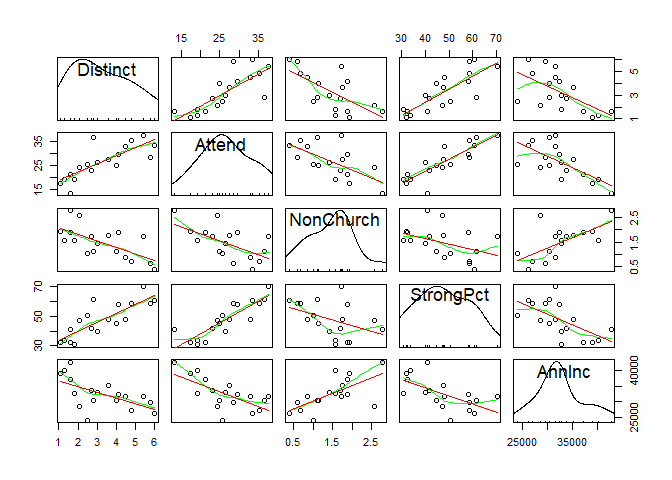
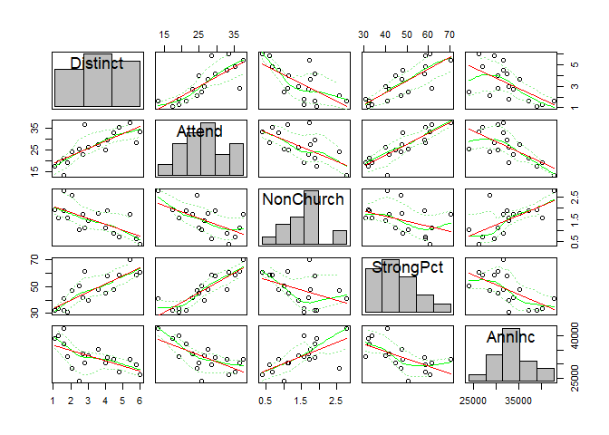
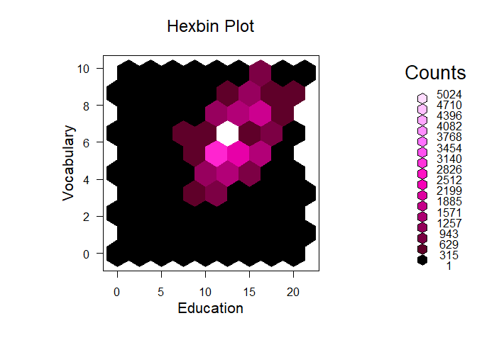
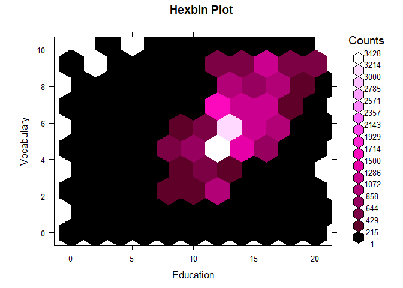
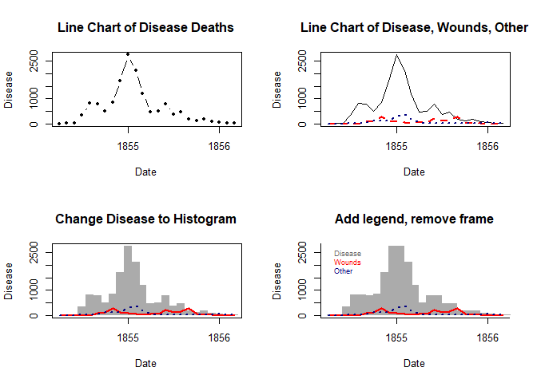

(Almost) Daily Plots
================
Conner McBride

About
-----

This repo is a simple container for my practice plots. I work with *ggplot*, *matplotlib*, and *Tableau* primarily to build attractive visualizations. The goal is to build a plot a day and add it to this container. As the title notes, I don't to adding a plot quite everyday...

The Plots
---------

**Plot 20 September 9, 20018:** Today is a single plot similar to the comibnation histogram and line plot in the last study. This time the default axis labels will be suppressed in favor of custom labels that give more information about independent and dependent variables.

**Plot 19 September 7, 2018:** A look at line plots, again using *Graphing Data with R*.

**Plot 18 September 5, 2018:** Next up is a study of scatter plots using *Graphing Data with R*. I think of scatter plots as akin to strip plots over two dimensions instead of just one. This is a versatile plot, not only allowing you to look at distributions or identify trends, but also to identify outliers and data points with potentially undue leverage. Depending on how the plot is implemented (i.e with labels or information contained in a hover tool), scatter plots can also be used to examine individual data points and compare their values to other points.

**Plot 17 September 3, 2018** Rug plots are appended to other types of charts in order to show single variable distributions that might otherwise not be apparent in the principal chart. Rug plots are conceptually similar to strip plots.

**Plot 16 September 1, 2018** Fan plots show proportional differences much better than the similar pie chart, but are not widely known or used so they can be confusing unless some instruction is given on how to interpret them.

At first, it wasn't clear with this plot how the total arc-span of the full plot is determined. For example, the plot above from *Graphing Data with R* happens to plot a aesthetically appealing angle, but when I tried plotting some data on some data of my own the results were different, specifically the total arc.

The arc of the fan is much wider and more difficult to take in at a glance, not to mention the title is pushed almost completely out of the plotframe. The argument that can be used to set the total arc is `max.span` and it takes radian values. For the same vector plotted above, I this time tried different values for `max.span`.

I tried some other values for `max.span` but with mixed results. For example, using `pi` resulted in a chart of which half looked like it was missing.

It seems like an arc of `2*pi/3 >= max.span > pi` is the best option. Values less than 2\*pi/3 risk not leaving enough room for labels.

**Plot 15 August 30, 2018** It's fallen out of vogue because it's difficult to interpret accurately, but the pie plot can still work well to show the proportional differences of a variable with two or three levels. A study of pie charts from *Graphing Data with R*.

**Plot 14 - August 29, 2018** Study of bar plot orientation and spacing from *Graphing Data with R*.

**Plot 13 - August 28, 2018** Bar Plot exercise from *Graphing Data with R*.

Spine Plot

**Plot 12 - August 26, 2018** Cumulative distribution plot from *Graphing Data with R*.

**Plot 11 - August 23, 2018** Practice of density plot and cumulative distribution plot from *Graphing Data with R*.

**Plot 10 - August 22, 2018** Study of histograms from *Graphing Data with R*.

**Plot 9 - August 17, 2018** Practicing with *Graphing Data with R*, a mainstay of single variable EDA, the boxplot.

**Plot 8 - August 16, 2018** Still working with *Graphing Data with R*. Next chart is a dot plot that adds another dimension over the simple strip plot.

**Plot 7 - August 15, 2018** Picked up Hilfiger's *Graphing Data with R*. To start the simple strip plot used for getting a quick look at the distribution and density of a variable.

**Plot 7 - June 6, 2018** Surveying the repertoire of basic Tableau charts. Practicing plots and here is the highlight chart with and without text.

**Plot 6 - May 18, 2018** A simple visualization using the [`elliplot` package](https://github.com/cran/elliplot) by Shinichiro Tomizono.The `ellipseplot` function that produces a correlation chart and visualizes the effect of factors on the relationship between the two principal variables. This plot is to test the capabilities of the function and is not optimized in terms of formatting.

**Plot 5 - May 6, 2018** This visualization was a duplication exercise of a [plot in the NYTimes](https://www.nytimes.com/2018/05/04/business/economy/jobs-report.html). It was created using ggplot2.

**Plot 4 - May 5, 2018**

This visualization looks at some key performance stats for some of the biggest and most well-known teams in professional hockey.

Data: www.sports-reference.com. Use agreement: <https://www.sports-reference.com/termsofuse.html>

It's also an exploration of slope charts and their implementation in Tableau as well as adding images to the hover tool window. The full dashboard can be experienced [here](https://public.tableau.com/profile/conner.mcbride#!/vizhome/NHLHockeyStatsSlopeChart/Dashboard1?publish=yes).And a snapshot:

**Plot 3 - April 24, 2018**

This plot, a slope chart, was inspired by the walk-through in Ben Jones' *Communicating Data with Tableau*. The dataset is one of the sample sets that comes with Tableau, World Indicators. The dataset worked well for practicing the slope chart but the slope chart isn't necessarily the best choice for some of the indicators that can be selected. Still it was great practice, and I've added an useful plot type to my repertoire. The full dashboard can be experienced [here](https://public.tableau.com/profile/conner.mcbride#!/vizhome/slopechart_exploration/Dashboard1?publish=yes). And a snapshot of the dashboard plotting changes in GDP between 2000 and 2012 on selected countries:

**Plot 2 - April 9, 2018**

This plot from a walk-through by Ben Jones in his book *Communicating Data with Tableau*. The full interactive dashboard can be experience [here](https://public.tableau.com/profile/conner.mcbride#!/vizhome/presidents_timeline/Dashboard1?publish=yes). A snapshot of the dashboard:

**Plot 1 - April 2, 2018**

Not just a plot, this example is a dynamic app that allows the user to select state and year values to plot the geographic distribution of earthquakes by the selected variables. The app uses a live API to query the USGS for historical earthquake data. The API algorithm required some maintaince work and help was provided by [other developers at StackOverflow](https://stackoverflow.com/questions/49545608/r-what-causes-error-when-using-usgs-api?noredirect=1#comment86099289_49545608). The reactive function uses max/min latitude and longitude of the selected state to narrow the query and speed plotting. It then tests each observation point with a "inpolygon" test, before plotting. The app can be experienced [here](https://connermcb.shinyapps.io/quakes_shiny_app/). A snapshot of the app and a sample plot:

**Plot 0 - March 27, 2018**

This plot is my rendition of a [beautiful line graph](https://www.nytimes.com/interactive/2018/03/23/climate/arctic-ice-maximum.html) published on March 3, 2018 in the New York Times that accompanied an article by KENDRA PIERRE-LOUIS, NADJA POPOVICH and ADAM PEARCE on decreases in arctic sea ice. My plot is an exercise in trying to produce similar results.

The plot was built with ggplot2 in RStudio.The dataset is documented and available from the [National Snow & Ice Data Center](https://nsidc.org/data/search/#keywords=sea+ice/sortKeys=score,,desc/facetFilters=%257B%257D/pageNumber=1/itemsPerPage=25) with compressed csv files for download at a [linked FTP server](ftp://sidads.colorado.edu/DATASETS/NOAA/G02135/).

