(Almost) Daily Plots
================
Conner McBride

## About

This repo is a simple container for my practice plots. I work with
*ggplot*, *matplotlib*, and *Tableau* primarily to build attractive
visualizations. The goal is to build a plot a day and add it to this
container. As the title notes, I don’t to adding a plot quite everyday…

## The Plots

**Plot 33 November 18, 2018:** Bubble Plots encoding third variable
point
size.

**Plot 32 November 17, 2018:** False Color Plots to encode a third
dimension with
color.

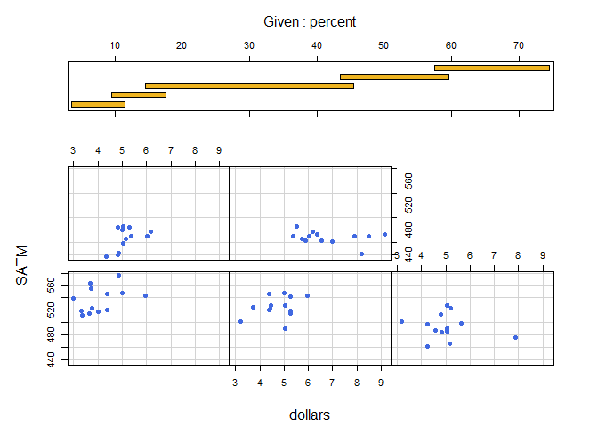

**Plot 31 November 15, 2018:** 3D Scatterplot with a prediction
plane.

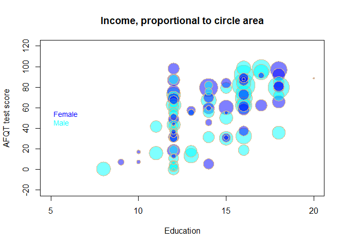

**Plot 30 November 7, 2018:** Moving over into multi-variable plots of
three or more dimensions, today taking a look at 3D scatter plots using
the scatterplot3d package and function. Again, just exploring the
lessons and charts in *Graphing Data with R*. The arguments for
`scatterplot3d` can be either a matrix or individual vectors x, y, and
z. Variable x is plotted on the horizontal axis, y on the diagonal axis,
and z on the vertical
axis.

**Plot 29 October 23, 2018:** A look at `corrgram`, a plot related to
the scatterplot matrix (see below) that show the linear correlation
between two quantitative variables. Again today, working from *Graphing
Data with
R*.

**Plot 28 October 13, 2018:**

The scatterplotMatrix plot function in the `car` package offers more
options like linear trend lines, smooth fit lines, and multiple options
for univariate charts in the plot spaces along the grid
diagonal.

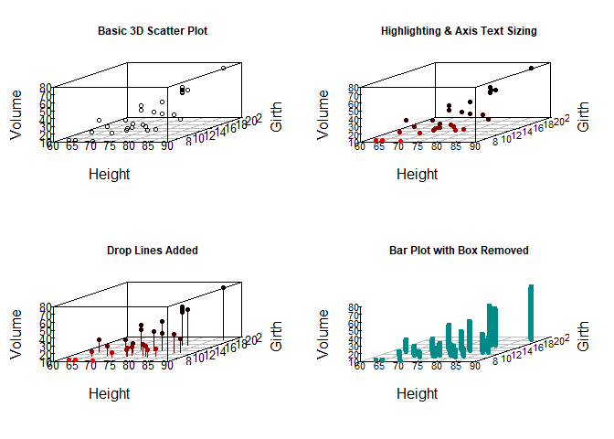

**Plot 27 October 12, 2018:** Still working with *Graphing Data with R*,
today we start with multivariable graphs. The pairs plot is good place
to start exploring a dataset and get an overview that might reveal
possible relationships among variables that warrent deeper analysis.

The pairs plot below looks at the relationships between all of the
variables in a dataset that looks at the strictness of religious
denominations and possible correlations to other social
metrics.

**Plot 26 October 2, 2018:** Today we look at charts that can be used to
compare the distributions of two vectors or
arrays.

**Plot 25 September 29, 2018:** The last of the charts featured in
*Graphing Data with R* designed to deal with dense data, the Hexbin
Plot. As the name suggest, the datapoints are binned geometrically into
hexagonally defined coordinate regions. A color gradient is used to fill
in the hexagonal regions according to their density.In this and the
smooth scatter plot, color gradients are used to encode
amounts,intensities, or
densities.

The above implementation uses the base plot function on the binned data.
The `hexbin` package also includes its own plotter which is much more
readily customizable. For
comparison:

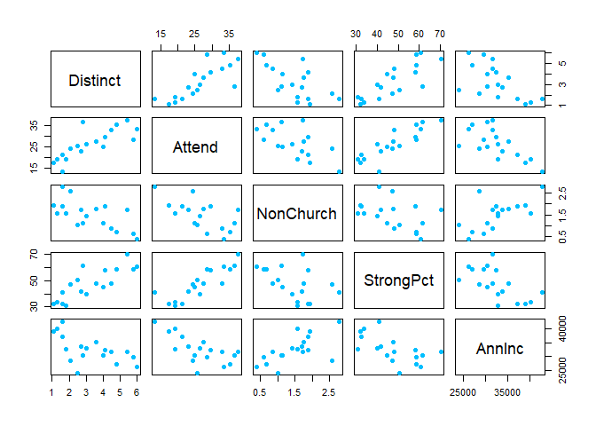

**Plot 24 September 28, 2018:** Continuing with different charts that
are well-suited to plotting large datasets and distinguising trends in
densly plotted cooridinate spaces, today we’ll look at a smooth scatter
plot. The smooth scatter plot uses color saturation and intensity to
show areas of high density. The smooth scatter plot shows granular
detail better than the jitter or sunflower plots
could.

**Plot 23 September 23, 2018:** Scatter plots that use discrete data
with a large number of points tend to overplot masking the true density
across the plot space. One method available to deal with this is to
apply a jitter function that offsets each point so that they aren’t
plotted directly over other points.

The examples below are from *Graphing Data with
R*.

The sunflower plot offers an alternative to applying the jitter function
to discrete data that tends to overplot. A *petal* or line is drawn for
each observation that fall on a particular coordinate in the plot. The
sunflower plot is one option for revealing the density of overplotted
data.

<!-- -->

**Plot 22 September 22, 2018:** The trellis plot is means of effectively
controlling for categorical variables by plotting separately the
intersections between the levels of these variables. The `xyplot()`
function is part of the lattice package which is specifically designed
for producing trellis plots. Here’s an example, that separates or facets
a two-variable scatter plot by the levels of third variable using panels
or frames for each level of the control
variable:

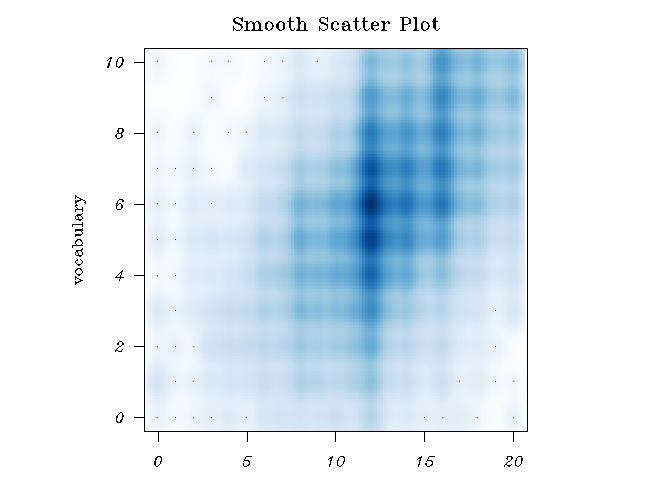

**Plot 21 September 18, 2018:** Today’s plot uses the scatter plot
function in the `car`
package.

**Plot 20 September 9, 2018:** Today is a single plot similar to the
comibnation histogram and line plot in the last study. This time the
default axis labels will be suppressed in favor of custom labels that
give more information about independent and dependent
variables.

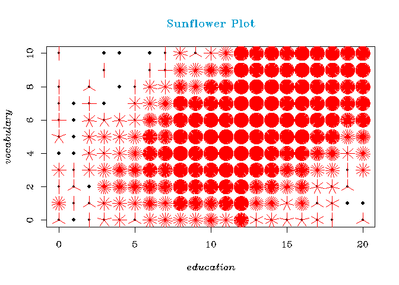

**Plot 19 September 7, 2018:** A look at line plots, again using
*Graphing Data with
R*.

**Plot 18 September 5, 2018:** Next up is a study of scatter plots using
*Graphing Data with R*. I think of scatter plots as akin to strip plots
over two dimensions instead of just one. This is a versatile plot, not
only allowing you to look at distributions or identify trends, but also
to identify outliers and data points with potentially undue leverage.
Depending on how the plot is implemented (i.e with labels or information
contained in a hover tool), scatter plots can also be used to examine
individual data points and compare their values to other
points.

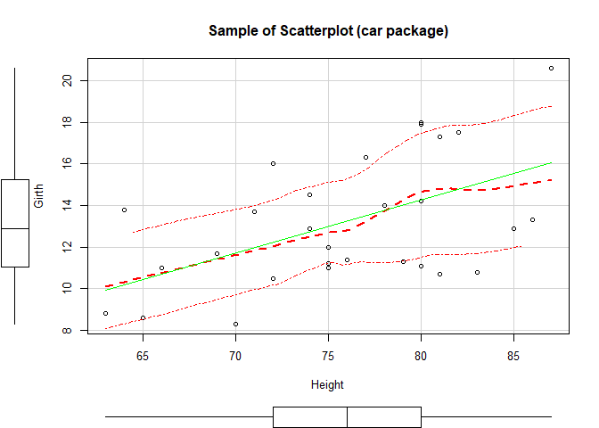

**Plot 17 September 3, 2018** Rug plots are appended to other types of
charts in order to show single variable distributions that might
otherwise not be apparent in the principal chart. Rug plots are
conceptually similar to strip
plots.

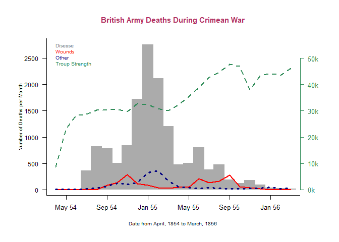

**Plot 16 September 1, 2018** Fan plots show proportional differences
much better than the similar pie chart, but are not widely known or used
so they can be confusing unless some instruction is given on how to
interpret
them.

At first, it wasn’t clear with this plot how the total arc-span of the
full plot is determined. For example, the plot above from *Graphing Data
with R* happens to plot a aesthetically appealing angle, but when I
tried plotting some data on some data of my own the results were
different, specifically the total
arc.

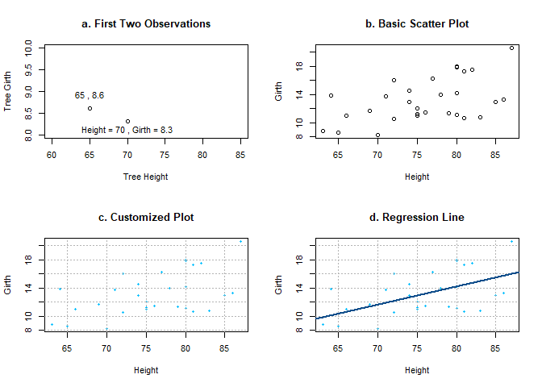

The arc of the fan is much wider and more difficult to take in at a
glance, not to mention the title is pushed almost completely out of the
plotframe. The argument that can be used to set the total arc is
`max.span` and it takes radian values. For the same vector plotted
above, I this time tried different values for
`max.span`.

I tried some other values for `max.span` but with mixed results. For
example, using `pi` resulted in a chart of which half looked like it was
missing.

It seems like an arc of `2*pi/3 >= max.span > pi` is the best option.
Values less than 2\*pi/3 risk not leaving enough room for labels.

**Plot 15 August 30, 2018** It’s fallen out of vogue because it’s
difficult to interpret accurately, but the pie plot can still work well
to show the proportional differences of a variable with two or three
levels. A study of pie charts from *Graphing Data with
R*.

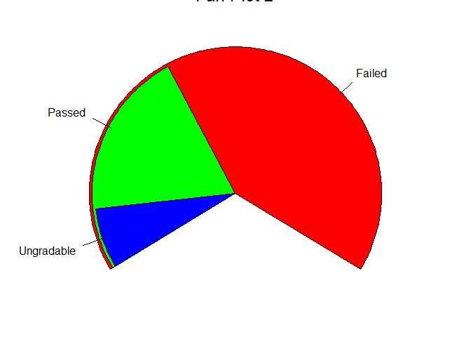

**Plot 14 - August 29, 2018** Study of bar plot orientation and spacing
from *Graphing Data with
R*.

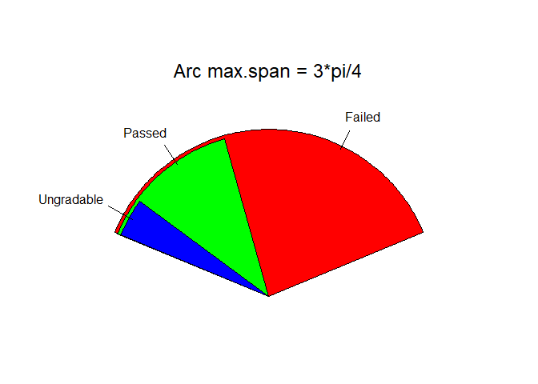

**Plot 13 - August 28, 2018** Bar Plot exercise from *Graphing Data with
R*.

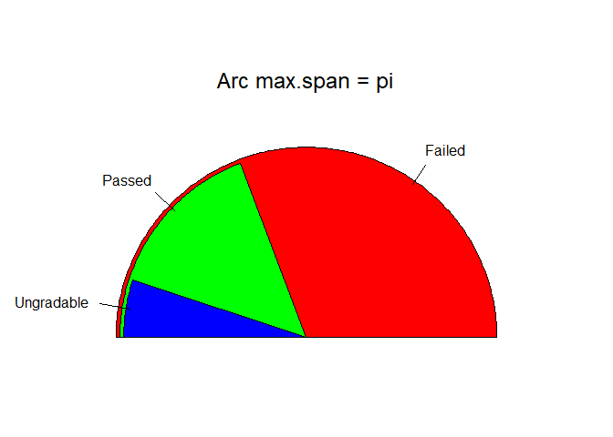

Spine
Plot

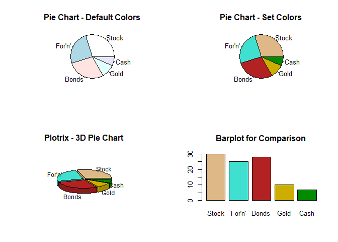

**Plot 12 - August 26, 2018** Cumulative distribution plot from
*Graphing Data with
R*.

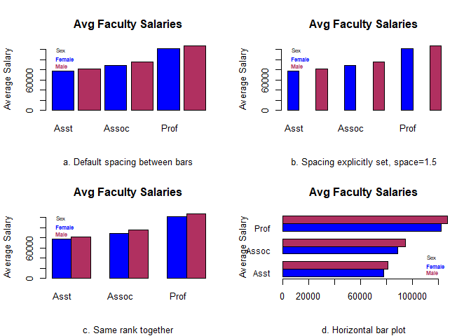

**Plot 11 - August 23, 2018** Practice of density plot and cumulative
distribution plot from *Graphing Data with
R*.

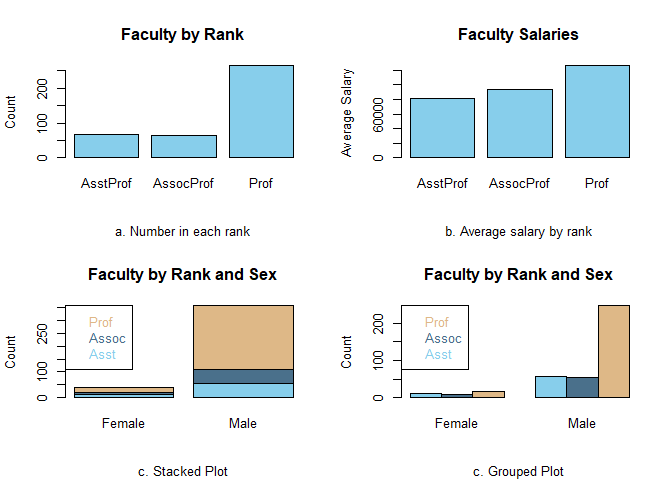

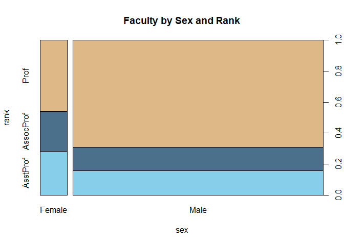

**Plot 10 - August 22, 2018** Study of histograms from *Graphing Data
with
R*.

<!-- -->

<!-- -->

**Plot 9 - August 17, 2018** Practicing with *Graphing Data with R*, a
mainstay of single variable EDA, the
boxplot.

**Plot 8 - August 16, 2018** Still working with *Graphing Data with R*.
Next chart is a dot plot that adds another dimension over the simple
strip
plot.

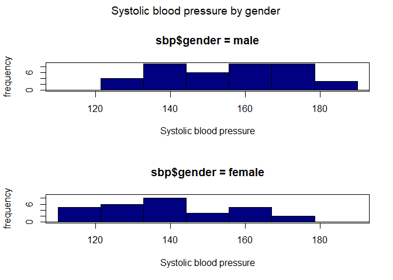

**Plot 7 - August 15, 2018** Picked up Hilfiger’s *Graphing Data with
R*. To start the simple strip plot used for getting a quick look at the
distribution and density of a
variable.

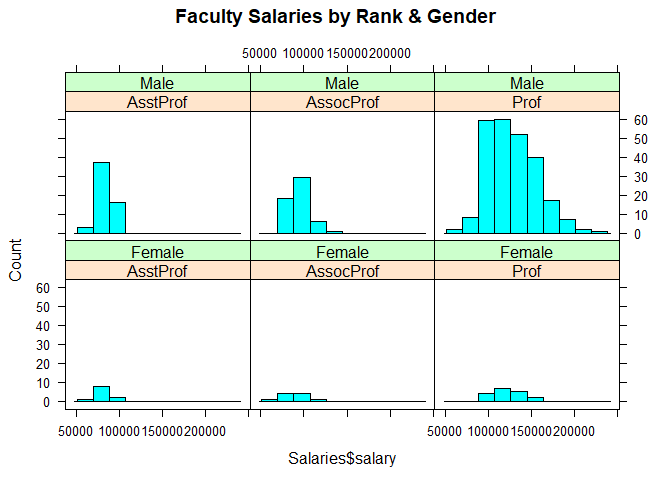

**Plot 7 - June 6, 2018** Surveying the repertoire of basic Tableau
charts. Practicing plots and here is the highlight chart with and
without text.

**Plot 6 - May 18, 2018** A simple visualization using the [`elliplot`
package](https://github.com/cran/elliplot) by Shinichiro Tomizono.The
`ellipseplot` function that produces a correlation chart and visualizes
the effect of factors on the relationship between the two principal
variables. This plot is to test the capabilities of the function and is
not optimized in terms of
formatting.

**Plot 5 - May 6, 2018** This visualization was a duplication exercise
of a [plot in the
NYTimes](https://www.nytimes.com/2018/05/04/business/economy/jobs-report.html).
It was created using
ggplot2.

**Plot 4 - May 5, 2018**

This visualization looks at some key performance stats for some of the
biggest and most well-known teams in professional hockey.

Data: www.sports-reference.com. Use agreement:
<https://www.sports-reference.com/termsofuse.html>

It’s also an exploration of slope charts and their implementation in
Tableau as well as adding images to the hover tool window. The full
dashboard can be experienced
[here](https://public.tableau.com/profile/conner.mcbride#!/vizhome/NHLHockeyStatsSlopeChart/Dashboard1?publish=yes).And
a snapshot:

**Plot 3 - April 24, 2018**

This plot, a slope chart, was inspired by the walk-through in Ben Jones’
*Communicating Data with Tableau*. The dataset is one of the sample sets
that comes with Tableau, World Indicators. The dataset worked well for
practicing the slope chart but the slope chart isn’t necessarily the
best choice for some of the indicators that can be selected. Still it
was great practice, and I’ve added an useful plot type to my repertoire.
The full dashboard can be experienced
[here](https://public.tableau.com/profile/conner.mcbride#!/vizhome/slopechart_exploration/Dashboard1?publish=yes).
And a snapshot of the dashboard plotting changes in GDP between 2000 and
2012 on selected countries:

**Plot 2 - April 9, 2018**

This plot from a walk-through by Ben Jones in his book *Communicating
Data with Tableau*. The full interactive dashboard can be experience
[here](https://public.tableau.com/profile/conner.mcbride#!/vizhome/presidents_timeline/Dashboard1?publish=yes).
A snapshot of the dashboard:

**Plot 1 - April 2, 2018**

Not just a plot, this example is a dynamic app that allows the user to
select state and year values to plot the geographic distribution of
earthquakes by the selected variables. The app uses a live API to query
the USGS for historical earthquake data. The API algorithm required some
maintaince work and help was provided by [other developers at
StackOverflow](https://stackoverflow.com/questions/49545608/r-what-causes-error-when-using-usgs-api?noredirect=1#comment86099289_49545608).
The reactive function uses max/min latitude and longitude of the
selected state to narrow the query and speed plotting. It then tests
each observation point with a “inpolygon” test, before plotting. The app
can be experienced
[here](https://connermcb.shinyapps.io/quakes_shiny_app/). A snapshot of
the app and a sample plot:

**Plot 0 - March 27, 2018**

This plot is my rendition of a [beautiful line
graph](https://www.nytimes.com/interactive/2018/03/23/climate/arctic-ice-maximum.html)
published on March 3, 2018 in the New York Times that accompanied an
article by KENDRA PIERRE-LOUIS, NADJA POPOVICH and ADAM PEARCE on
decreases in arctic sea ice. My plot is an exercise in trying to produce
similar results.

The plot was built with ggplot2 in RStudio.The dataset is documented and
available from the [National Snow & Ice Data
Center](https://nsidc.org/data/search/#keywords=sea+ice/sortKeys=score,,desc/facetFilters=%257B%257D/pageNumber=1/itemsPerPage=25)
with compressed csv files for download at a [linked FTP
server](ftp://sidads.colorado.edu/DATASETS/NOAA/G02135/).

